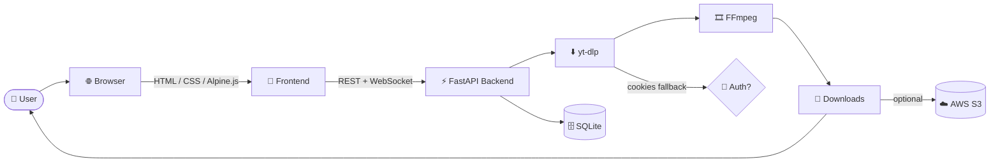
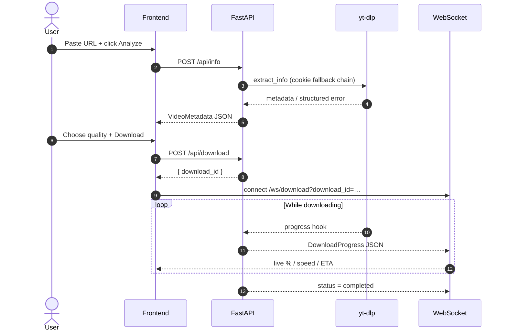
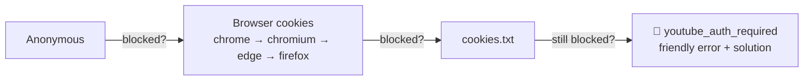

<div align="center">

# 🎬 Universal Video Downloader

### Download videos in the best quality from hundreds of websites — through a beautiful, self-hosted web app.

_A production-grade, open-source video downloader powered by **FastAPI** + **yt-dlp**, with a modern glassmorphism UI, live progress over WebSockets, an automatic cookie-authentication pipeline, and one-command Docker / AWS deployment._

<br/>

[](https://github.com/PatvakanGasparyan/Universal_Video_Downloader/releases)
[](https://github.com/PatvakanGasparyan/Universal_Video_Downloader/actions/workflows/ci.yml)
[](LICENSE)
[](https://github.com/PatvakanGasparyan/Universal_Video_Downloader/commits)
[](https://github.com/PatvakanGasparyan/Universal_Video_Downloader/stargazers)

[](https://www.python.org/)
[](https://fastapi.tiangolo.com/)
[](https://github.com/yt-dlp/yt-dlp)
[](https://www.docker.com/)
[](https://alpinejs.dev/)
[](https://tailwindcss.com/)
[](docs/AWS.md)

</div>

---

## 📑 Table of Contents

- [🌐 Live Application](#-live-application)
- [✨ Overview](#-overview)
- [🚀 Features](#-features)
- [🖼️ Screenshots](#️-screenshots)
- [🏗️ Architecture](#️-architecture)
- [📁 Project Structure](#-project-structure)
- [⚡ Quick Start](#-quick-start)
- [🛠️ Installation](#️-installation)
- [🐳 Running with Docker](#-running-with-docker)
- [☁️ AWS Deployment](#️-aws-deployment)
- [🍪 Cookies (YouTube Authentication)](#-cookies-youtube-authentication)
- [🎞️ FFmpeg](#️-ffmpeg)
- [⬇️ yt-dlp](#️-yt-dlp)
- [⚙️ Configuration](#️-configuration)
- [🔌 API](#-api)
- [🚦 Error Codes](#-error-codes)
- [🧰 Technologies](#-technologies)
- [📈 Performance](#-performance)
- [🔒 Security](#-security)
- [❓ FAQ](#-faq)
- [🩺 Troubleshooting](#-troubleshooting)
- [🗺️ Roadmap](#️-roadmap)
- [📝 Changelog](#-changelog)
- [🤝 Contributing](#-contributing)
- [💬 Support](#-support)
- [📚 Documentation Index](#-documentation-index)
- [📄 License](#-license)

---

## 🌐 Live Application

Once deployed, the app is available on port **8000**:

| Page | URL |
|------|-----|
| 🏠 **Application** | `http://SERVER_IP:8000` |
| ⚙️ **Settings** | `http://SERVER_IP:8000/settings` |
| 🕒 **History** | `http://SERVER_IP:8000/history` |
| 📘 **API (Swagger)** | `http://SERVER_IP:8000/docs` |
| 📕 **API (ReDoc)** | `http://SERVER_IP:8000/redoc` |
| ❤️ **Health check** | `http://SERVER_IP:8000/api/health` |

> [!IMPORTANT]
> Replace **`SERVER_IP`** with your server's **public IPv4 address**.
> - On **AWS EC2**, this is the instance's *Public IPv4 address* (or an attached **Elastic IP**). Find it in the EC2 console → *Instances* → *Details*.
> - Running **locally**, use [`http://localhost:8000`](http://localhost:8000).
> - Make sure inbound TCP **port 8000** is open in your firewall / EC2 **Security Group**. See [docs/AWS.md](docs/AWS.md).

---

## ✨ Overview

**Universal Video Downloader** is a self-hosted web application that lets you fetch videos and audio from **hundreds of websites** that [yt-dlp](https://github.com/yt-dlp/yt-dlp) supports — YouTube, TikTok, Instagram, Vimeo, Twitch, Rutube, and many more — all from a clean, responsive browser UI.

<table>
<tr>
<td width="50%" valign="top">

**👤 Who is it for?**

- Self-hosters who want their own private downloader
- Developers who need a clean FastAPI + yt-dlp reference project
- Anyone who wants a nice UI instead of the command line
- DevOps engineers showcasing Docker / Terraform / k3s / AWS

</td>
<td width="50%" valign="top">

**🎯 Main use cases**

- Archiving your own content and public videos
- Extracting audio (MP3/FLAC/…) from videos
- Batch downloads via a live queue
- Running a personal downloader on a cheap VPS/EC2

</td>
</tr>
</table>

**🏆 Why this project over a bare `yt-dlp` command?**

| | This project | Raw yt-dlp CLI | Random online sites |
|---|:---:|:---:|:---:|
| Beautiful web UI | ✅ | ❌ | ⚠️ ads/malware |
| Live progress (WebSocket) | ✅ | ⚠️ terminal | ❌ |
| Automatic cookie fallback | ✅ | ⚠️ manual flags | ❌ |
| Structured error messages | ✅ | ❌ raw tracebacks | ❌ |
| Download history & favorites | ✅ | ❌ | ❌ |
| Self-hosted & private | ✅ | ✅ | ❌ |
| One-command Docker deploy | ✅ | ❌ | — |

---

## 🚀 Features

<div align="center">

### Supported platforms (and hundreds more via yt-dlp)

</div>

| | | | |
|---|---|---|---|
| ✅ YouTube | ✅ Rutube | ✅ Vimeo | ✅ Twitch |
| ✅ TikTok | ✅ X (Twitter) | ✅ Facebook | ✅ Instagram |
| ✅ Dailymotion | ✅ Bilibili | ✅ SoundCloud | ✅ Reddit |
| ✅ VK | ✅ Threads | ✅ …and [1000+ sites](https://github.com/yt-dlp/yt-dlp/blob/master/supportedsites.md) | ✅ |

<div align="center">

### Capabilities

</div>

| Feature | Description |
|---------|-------------|
| 🎥 **Any quality** | `best`, 8K, 4K, 1440p, 1080p, 720p, 480p, 360p |
| 📦 **Video formats** | MP4, MKV, WEBM, AVI, MOV |
| 🎵 **Audio extraction** | MP3, AAC, M4A, FLAC, WAV, OGG |
| 🍪 **Automatic cookies** | Anonymous → browser cookies → `cookies.txt` fallback chain |
| 📡 **Live progress** | Real-time speed, ETA, %, and stage over WebSockets |
| 📋 **Download queue** | Concurrent downloads with pause / resume / cancel / priority |
| 🕒 **History** | Search, favorite, delete, re-download |
| 🌍 **i18n** | English 🇬🇧 · Русский 🇷🇺 · Հայերեն 🇦🇲 — instant switching |
| 🌗 **Themes** | Dark / light mode, glassmorphism design |
| 🧩 **Structured errors** | Machine-readable `{error, message, solution}` envelopes |
| ☁️ **S3 storage** | Optional upload of finished files to AWS S3 |
| 🐳 **Docker-ready** | `docker compose up -d` and you're live |
| 🧪 **Tested** | 100+ tests, ruff-clean, CI on every push |

---

## 🖼️ Screenshots

> [!NOTE]
> Add your own screenshots to `docs/images/`. Placeholders are referenced below.

<table>
<tr>
<td width="50%"><b>🏠 Home</b><br/></td>
<td width="50%"><b>⚙️ Settings</b><br/></td>
</tr>
<tr>
<td width="50%"><b>⬇️ Download in progress</b><br/></td>
<td width="50%"><b>🕒 History</b><br/></td>
</tr>
<tr>
<td width="50%"><b>📋 Queue</b><br/></td>
<td width="50%"><b>🚦 Structured error</b><br/></td>
</tr>
</table>

---

## 🏗️ Architecture

A high-level view. **Full diagrams** (system, request flow, Docker, AWS, sequence, download pipeline, cookie flow, error handling, and more) live in **[docs/ARCHITECTURE.md](docs/ARCHITECTURE.md)**.



<details>
<summary><b>📽️ Request sequence (metadata → download → progress)</b></summary>



</details>

---

## 📁 Project Structure

```text
universal-video-downloader/
├── backend/                  # FastAPI application
│   ├── api/                  # Routes, deps, middleware
│   │   └── routes/           # info, download, history, settings, formats
│   ├── services/             # yt-dlp, download queue, cookies, exceptions, S3
│   ├── models/               # Pydantic schemas + SQLAlchemy ORM
│   ├── database/             # Async session, migrations
│   ├── config/               # Settings + structured logging
│   ├── localization/         # Backend i18n loader
│   ├── websocket/            # WebSocket handlers
│   └── main.py               # App entry point + exception handlers
├── frontend/                 # Static web UI (no build step)
│   ├── html/                 # index, history, settings
│   ├── css/                  # Glassmorphism styles
│   ├── js/                   # Alpine.js app, API client, i18n
│   ├── localization/         # en.json, ru.json, hy.json
│   └── assets/               # Icons / images
├── terraform/                # AWS IaC: EC2, S3, IAM, VPC
├── k8s/                      # k3s manifests: Deployment, Service, ConfigMap
├── docker/                   # Nginx reverse-proxy config
├── docs/                     # 📚 Full documentation (see index below)
├── scripts/                  # Dev/utility scripts (run_dev.py, …)
├── tests/                    # unit / api / integration / frontend
├── config/                   # Runtime config (cookies.txt location)
├── data/                     # SQLite DB + persistent cookies (gitignored)
├── Dockerfile                # Multi-stage build (python:3.13-slim)
├── docker-compose.yml        # app + optional redis + nginx profiles
├── requirements.txt          # Dev + runtime dependencies
├── requirements-prod.txt     # Runtime-only (smaller image)
└── README.md
```

---

## ⚡ Quick Start

```bash
# 1. Clone
git clone https://github.com/PatvakanGasparyan/Universal_Video_Downloader.git
cd Universal_Video_Downloader

# 2. Run with Docker (easiest)
cp .env.example .env
docker compose up -d

# 3. Open the app
#    → http://localhost:8000
```

> [!TIP]
> Prefer a native install? Jump to [🛠️ Installation](#️-installation). Full step-by-step is in **[docs/INSTALL.md](docs/INSTALL.md)**.

---

## 🛠️ Installation

**Requirements:** Python **3.13+**, **FFmpeg**, and (bundled via pip) **yt-dlp**.

<details>
<summary><b>🐧 Linux — Ubuntu / Debian</b></summary>

```bash
sudo apt update
sudo apt install -y python3.13 python3.13-venv ffmpeg git

git clone https://github.com/PatvakanGasparyan/Universal_Video_Downloader.git
cd Universal_Video_Downloader

python3.13 -m venv .venv
source .venv/bin/activate
pip install -r requirements.txt

cp .env.example .env
python scripts/run_dev.py
```

</details>

<details>
<summary><b>🪟 Windows (PowerShell)</b></summary>

```powershell
winget install Python.Python.3.13
winget install Gyan.FFmpeg
winget install Git.Git

git clone https://github.com/PatvakanGasparyan/Universal_Video_Downloader.git
cd Universal_Video_Downloader

python -m venv .venv
.venv\Scripts\Activate.ps1
pip install -r requirements.txt

Copy-Item .env.example .env
python scripts/run_dev.py
```

</details>

<details>
<summary><b>🍎 macOS</b></summary>

```bash
brew install python@3.13 ffmpeg git

git clone https://github.com/PatvakanGasparyan/Universal_Video_Downloader.git
cd Universal_Video_Downloader

python3.13 -m venv .venv
source .venv/bin/activate
pip install -r requirements.txt

cp .env.example .env
python scripts/run_dev.py
```

</details>

Then open **[http://localhost:8000](http://localhost:8000)**. 📖 More detail: **[docs/INSTALL.md](docs/INSTALL.md)**.

---

## 🐳 Running with Docker

```bash
# Build + start in the background
docker compose up -d --build

# View logs
docker compose logs -f app

# Stop
docker compose down
```

With the **Nginx** reverse proxy (ports 80/443):

```bash
docker compose --profile proxy up -d
```

With the optional **Redis** profile:

```bash
docker compose --profile queue up -d
```

> Volumes persist your database, cookies, and downloads across restarts. Full reference: **[docs/DOCKER.md](docs/DOCKER.md)**.

---

## ☁️ AWS Deployment

This repo ships **Infrastructure as Code** (Terraform) and **k3s** manifests, plus a GitHub Actions pipeline that builds the image on GHCR and deploys to EC2.

```bash
# Provision EC2 + S3 + IAM + VPC
cd terraform
cp terraform.tfvars.example terraform.tfvars   # edit values
terraform init
terraform apply

# Terraform prints the EC2 public IP — open http://<EC2_IP>:8000
```

> [!WARNING]
> Open inbound **TCP 8000** (app) and **22** (SSH) in the EC2 **Security Group**, and prefer an **Elastic IP** so the address survives restarts. Complete walkthrough (Security Groups, Elastic IP, domain, HTTPS, Nginx, SSL): **[docs/AWS.md](docs/AWS.md)** and **[docs/DEPLOYMENT.md](docs/DEPLOYMENT.md)**.

---

## 🍪 Cookies (YouTube Authentication)

YouTube increasingly returns **“Sign in to confirm you’re not a bot.”** The app solves this with an **automatic fallback chain** and an easy cookie upload.



**Get cookies in 5 steps** using the **Get cookies.txt LOCALLY** browser extension:

1. 🧩 Install **“Get cookies.txt LOCALLY”** (Chrome / Edge / Firefox / Brave / Chromium).
2. 🔑 Log in to [YouTube](https://www.youtube.com) in that browser.
3. 💾 Click the extension → **Export** cookies for `youtube.com` (Netscape format).
4. ⬆️ In the app go to **Settings → Cookies**, upload or paste the `cookies.txt`, click **Save**.
5. ✅ Done — cookies live in `./data/cookies.txt` (persistent) and are used automatically.

> [!CAUTION]
> `cookies.txt` contains your login session — treat it like a password. It is **gitignored** and never committed. Full guide + troubleshooting + per-browser steps: **[docs/COOKIES.md](docs/COOKIES.md)**.

---

## 🎞️ FFmpeg

FFmpeg is required for merging video+audio and format/audio conversion.

| OS | Command |
|----|---------|
| 🐧 Ubuntu/Debian | `sudo apt install -y ffmpeg` |
| 🪟 Windows | `winget install Gyan.FFmpeg` |
| 🍎 macOS | `brew install ffmpeg` |
| 🐳 Docker | Pre-installed in the image ✔️ |

If FFmpeg isn’t on `PATH`, set `FFMPEG_LOCATION` in `.env` to the binary path.

---

## ⬇️ yt-dlp

`yt-dlp` is installed automatically via `requirements.txt` (pinned to **≥ 2025.6.9**). To update to the latest extractors:

```bash
pip install -U yt-dlp
# or rebuild the Docker image to pull the newest release
docker compose build --no-cache app
```

> Keeping yt-dlp current is the #1 fix when a specific site suddenly breaks.

---

## ⚙️ Configuration

All settings come from environment variables (`.env`). The most common ones:

| Variable | Default | Description |
|----------|---------|-------------|
| `BACKEND_PORT` | `8000` | HTTP port |
| `SECRET_KEY` | `change-me-in-production` | App secret (**change it!**) |
| `MAX_CONCURRENT_DOWNLOADS` | `3` | Parallel downloads |
| `COOKIES_FILE` | `./data/cookies.txt` | Cookie file path |
| `COOKIES_FROM_BROWSER` | `true` | Try browser cookies (set **false** on servers) |
| `FFMPEG_LOCATION` | _(PATH)_ | Custom FFmpeg path |
| `S3_ENABLED` | `false` | Upload finished files to S3 |
| `RATE_LIMIT` | `30/minute` | API rate limit |

📖 **Every** variable, JSON, and YAML field is documented in **[docs/CONFIGURATION.md](docs/CONFIGURATION.md)**.

---

## 🔌 API

Interactive docs: **`/docs`** (Swagger) and **`/redoc`** (ReDoc).

| Method | Endpoint | Description |
|--------|----------|-------------|
| `POST` | `/api/info` | Extract video metadata |
| `POST` | `/api/download` | Queue a download |
| `GET` | `/api/status/{id}` | Download status |
| `POST` | `/api/download/{id}/pause` | Pause |
| `POST` | `/api/download/{id}/resume` | Resume |
| `POST` | `/api/download/{id}/cancel` | Cancel |
| `GET` | `/api/history` | List history |
| `DELETE` | `/api/history/{id}` | Delete history entry |
| `POST` | `/api/history/{id}/favorite` | Toggle favorite |
| `GET` | `/api/settings` | Get settings |
| `POST` | `/api/settings` | Update settings |
| `GET` / `POST` | `/api/settings/cookies` | Cookie status / upload |
| `GET` | `/api/formats` | Supported formats & platforms |
| `GET` | `/api/health` | Health check |
| `WS` | `/ws/download?download_id=…` | Live progress stream |

<details>
<summary><b>Example: fetch metadata</b></summary>

```bash
curl -X POST http://SERVER_IP:8000/api/info \
  -H "Content-Type: application/json" \
  -d '{"url": "https://www.youtube.com/watch?v=dQw4w9WgXcQ"}'
```

```json
{
  "url": "https://www.youtube.com/watch?v=dQw4w9WgXcQ",
  "title": "Example video",
  "channel": "Example channel",
  "duration": 213,
  "formats": [{ "id": "video-1080p-mp4", "label": "1080p MP4", "quality": "1080p", "format": "mp4" }]
}
```

</details>

Full request/response/error examples: **[docs/API.md](docs/API.md)**.

---

## 🚦 Error Codes

Every failure returns a structured envelope — **raw yt-dlp tracebacks are never exposed**:

```json
{
  "success": false,
  "error": "youtube_auth_required",
  "message": "Authentication required.",
  "solution": "Upload cookies.txt in Settings, then try again."
}
```

| Code | HTTP | Meaning |
|------|:----:|---------|
| `youtube_auth_required` / `auth_required` | 401 | Site needs cookies / sign-in |
| `video_unavailable` | 404 | Private, removed, or 404 |
| `geo_restricted` | 451 | Blocked in server region |
| `rate_limited` | 429 | Too many requests |
| `unsupported_url` | 400 | Not a supported site |
| `invalid_url` | 400 | Malformed URL |
| `network_error` | 502 | Timeout / connection issue |
| `cancelled` | 409 | Download cancelled |
| `download_failed` | 422 | Generic failure |
| `internal_error` | 500 | Unexpected server error |

Full reference with causes & fixes: **[docs/ERRORS.md](docs/ERRORS.md)**.

---

## 🧰 Technologies

| Layer | Tech |
|-------|------|
| 🐍 Language | Python 3.13+ |
| ⚡ Backend | FastAPI, Uvicorn, Pydantic v2, SQLAlchemy (async), aiosqlite |
| ⬇️ Engine | yt-dlp + FFmpeg |
| 🎨 Frontend | HTML5, CSS3, Tailwind-style CSS, Alpine.js, Font Awesome |
| 🗄️ Database | SQLite (async) |
| ☁️ Storage | Local FS + optional AWS S3 (boto3) |
| 🐳 Containers | Docker, Docker Compose (multi-stage build) |
| ☸️ Orchestration | k3s (Kubernetes) |
| 🏗️ IaC | Terraform (EC2, S3, IAM, VPC) |
| 🔁 CI/CD | GitHub Actions + GHCR |
| 🌐 Proxy | Nginx (optional) |

---

## 📈 Performance

- **Asynchronous everything** — non-blocking I/O with `asyncio`; yt-dlp runs in a thread pool so the event loop stays responsive.
- **Metadata caching** — repeated lookups for the same URL are served from cache (`METADATA_CACHE_TTL`).
- **Concurrent queue** — a semaphore caps parallelism (`MAX_CONCURRENT_DOWNLOADS`) to protect CPU/RAM.
- **Duplicate coalescing** — identical in-flight requests reuse one job.
- **GZip + keep-alive** — compressed responses and connection reuse.
- **Small image** — multi-stage `python:3.13-slim` build with runtime-only deps.

Tuning tips: **[docs/CONFIGURATION.md](docs/CONFIGURATION.md)** · **[docs/TROUBLESHOOTING.md](docs/TROUBLESHOOTING.md)**.

---

## 🔒 Security

- 🍪 **Cookies** are stored locally in `./data/cookies.txt`, gitignored, and never logged or committed.
- 🔑 **Secrets** via environment variables / k8s Secrets — never hard-coded.
- 🛡️ **Hardening** — input validation, URL sanitization, path-traversal protection, rate limiting, security headers, CORS.
- 🐳 **Docker** — minimal base image, no build tools in the final layer, isolated volumes.
- 🚫 **No raw errors** — structured envelopes prevent internal detail leakage.

Report vulnerabilities and read the full policy in **[SECURITY.md](SECURITY.md)**.

---

## ❓ FAQ

<details>
<summary><b>Is this legal?</b></summary>

The tool uses yt-dlp for personal use. Respect copyright and each platform’s Terms of Service in your jurisdiction. You are responsible for how you use it.
</details>

<details>
<summary><b>YouTube says “Sign in to confirm you’re not a bot” — what do I do?</b></summary>

Upload a fresh `cookies.txt` in **Settings → Cookies**. On servers set `COOKIES_FROM_BROWSER=false` and rely on the uploaded file. See **[docs/COOKIES.md](docs/COOKIES.md)**.
</details>

<details>
<summary><b>Why does Rutube fail with “HTTP Error 404”?</b></summary>

Outdated yt-dlp. Update it: `pip install -U yt-dlp` (or rebuild the image). This repo pins `yt-dlp>=2025.6.9`.
</details>

<details>
<summary><b>Can I download playlists / audio only?</b></summary>

Audio-only extraction (MP3, FLAC, …) is fully supported. Playlist support is on the [roadmap](docs/ROADMAP.md).
</details>

40+ more answers: **[docs/FAQ.md](docs/FAQ.md)**.

---

## 🩺 Troubleshooting

| Symptom | Likely fix |
|---------|-----------|
| YouTube bot block | Upload cookies (**[docs/COOKIES.md](docs/COOKIES.md)**) |
| A site broke overnight | `pip install -U yt-dlp` / rebuild image |
| `FFmpeg not found` | Install FFmpeg or set `FFMPEG_LOCATION` |
| Can’t reach `:8000` on AWS | Open port 8000 in the Security Group |
| WebSocket won’t connect | Use the same host/port; check proxy upgrades |
| Permission errors | Ensure `DOWNLOADS_DIR` / `data/` are writable |

Detailed guide (Docker, permissions, disk space, firewalls, browser auth): **[docs/TROUBLESHOOTING.md](docs/TROUBLESHOOTING.md)**.

---

## 🗺️ Roadmap

- [x] Cookie fallback pipeline + structured errors
- [x] Docker / Terraform / k3s / GitHub Actions
- [ ] Playlist & channel downloads
- [ ] Subtitle download & conversion (SRT/VTT)
- [ ] Optional user authentication (admin/user roles)
- [ ] Download scheduler & bandwidth limiter

Full roadmap: **[docs/ROADMAP.md](docs/ROADMAP.md)**.

---

## 📝 Changelog

See **[CHANGELOG.md](CHANGELOG.md)** — this project follows [Keep a Changelog](https://keepachangelog.com/) and [Semantic Versioning](https://semver.org/).

---

## 🤝 Contributing

Contributions are welcome! Please read **[CONTRIBUTING.md](CONTRIBUTING.md)** and the **[Code of Conduct](CODE_OF_CONDUCT.md)**.

```bash
# Fork → branch → change → test → PR
ruff check backend tests
pytest --cov=backend
```

---

## 💬 Support

- 🐛 **Bug?** Open a [Bug Report](https://github.com/PatvakanGasparyan/Universal_Video_Downloader/issues/new?template=bug_report.yml)
- 💡 **Idea?** Open a [Feature Request](https://github.com/PatvakanGasparyan/Universal_Video_Downloader/issues/new?template=feature_request.yml)
- 💬 **Question?** Start a [Discussion](https://github.com/PatvakanGasparyan/Universal_Video_Downloader/discussions)

---

## 📚 Documentation Index

| Doc | What's inside |
|-----|---------------|
| 📥 [INSTALL.md](docs/INSTALL.md) | Step-by-step install for every OS |
| 🚀 [DEPLOYMENT.md](docs/DEPLOYMENT.md) | VPS, reverse proxy, Nginx/Apache, Cloudflare |
| 🐳 [DOCKER.md](docs/DOCKER.md) | Dockerfile, compose, volumes, networks |
| ☁️ [AWS.md](docs/AWS.md) | EC2, Security Groups, Elastic IP, HTTPS |
| 🏗️ [ARCHITECTURE.md](docs/ARCHITECTURE.md) | 14 Mermaid diagrams |
| 🔌 [API.md](docs/API.md) | Every endpoint with examples |
| ⚙️ [CONFIGURATION.md](docs/CONFIGURATION.md) | Every setting explained |
| 🍪 [COOKIES.md](docs/COOKIES.md) | Full cookie guide per browser |
| 🚦 [ERRORS.md](docs/ERRORS.md) | Every error code |
| ❓ [FAQ.md](docs/FAQ.md) | 40+ questions |
| 🩺 [TROUBLESHOOTING.md](docs/TROUBLESHOOTING.md) | Fix common problems |
| 🗺️ [ROADMAP.md](docs/ROADMAP.md) | Planned features |
| 🔒 [SECURITY.md](SECURITY.md) | Security policy |
| 🤝 [CONTRIBUTING.md](CONTRIBUTING.md) | Dev workflow |

---

## 📄 License

Released under the **[MIT License](LICENSE)** © 2026 Universal Video Downloader Contributors.

<div align="center">

**⚠️ Disclaimer:** This software is for personal and educational use. Respect copyright laws and the Terms of Service of every website you download from.

<br/>

_If this project helped you, please consider giving it a ⭐ — it really helps!_

Made with ❤️ using [FastAPI](https://fastapi.tiangolo.com/) and [yt-dlp](https://github.com/yt-dlp/yt-dlp)

</div>
