# 🏗️ Architecture

> A deep dive into how **Universal Video Downloader** is built, with Mermaid diagrams that render natively on GitHub.

## 📑 Contents

- [System Architecture](#system-architecture)
- [Request Flow](#request-flow)
- [Component Diagram](#component-diagram)
- [Sequence Diagram](#sequence-diagram)
- [Download Pipeline](#download-pipeline)
- [Cookie Authentication Flow](#cookie-authentication-flow)
- [Error Handling Flow](#error-handling-flow)
- [Configuration Flow](#configuration-flow)
- [Application Startup Flow](#application-startup-flow)
- [Data Flow](#data-flow)
- [Class Diagram](#class-diagram)
- [Docker Architecture](#docker-architecture)
- [AWS Deployment](#aws-deployment)
- [Network Flow](#network-flow)
- [Folder Structure](#folder-structure)

---

## System Architecture

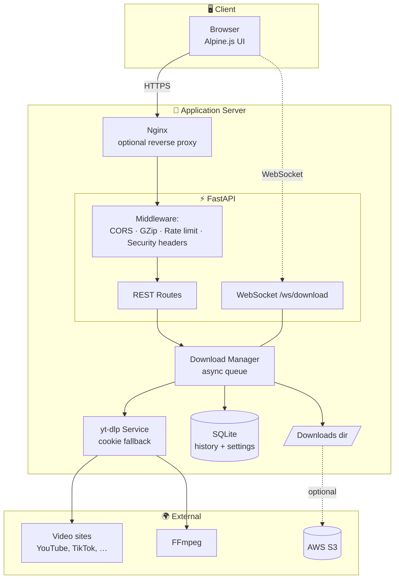

---

## Request Flow

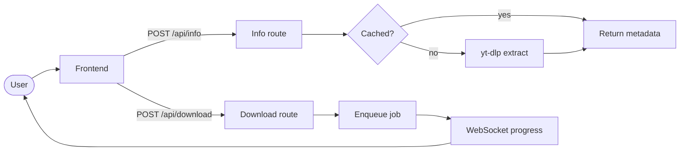

---

## Component Diagram

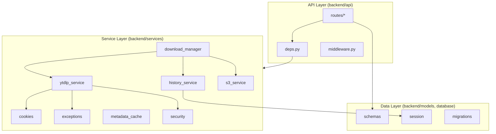

---

## Sequence Diagram

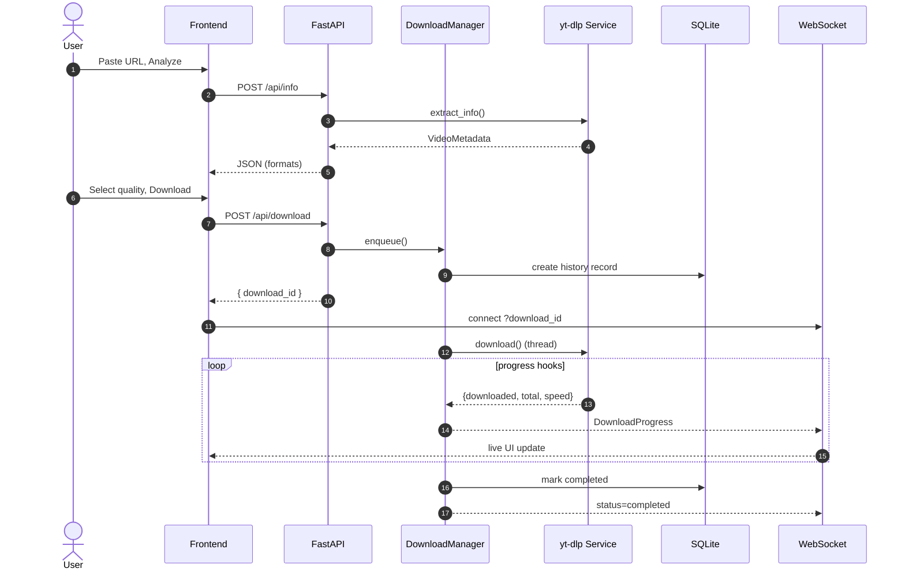

---

## Download Pipeline

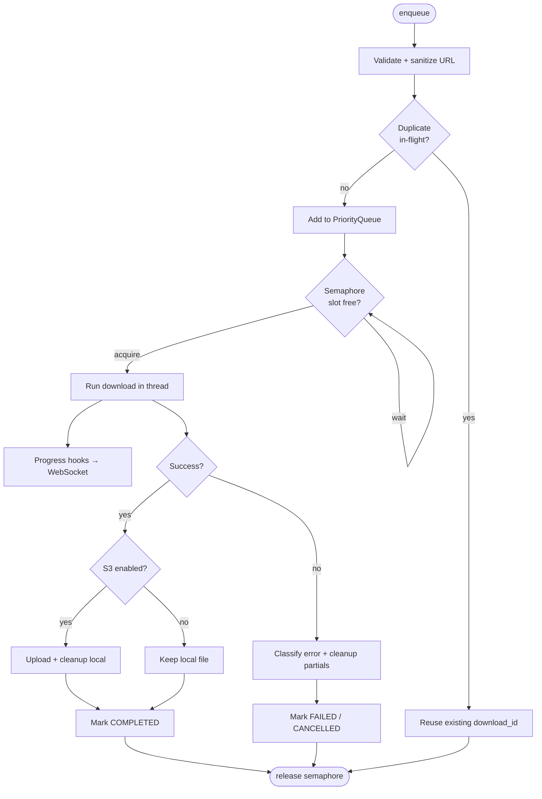

---

## Cookie Authentication Flow

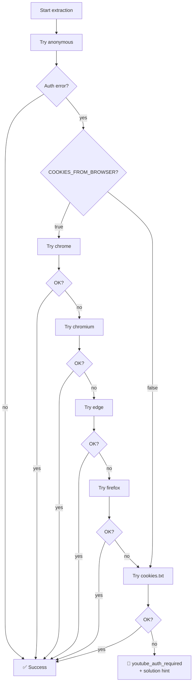

---

## Error Handling Flow

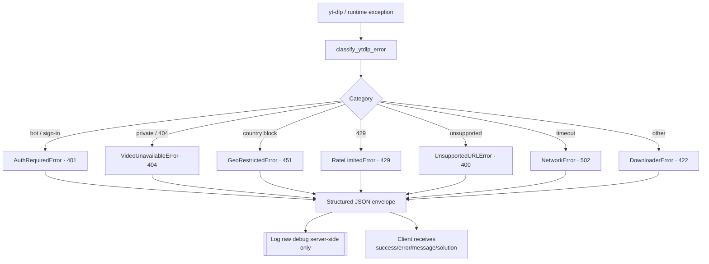

---

## Configuration Flow

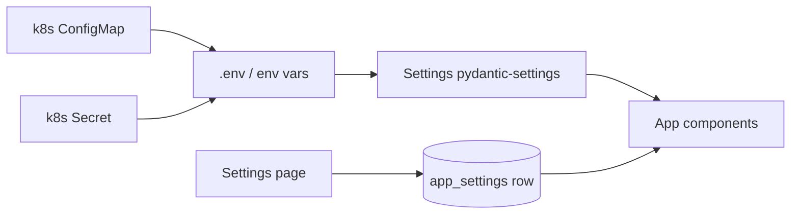

---

## Application Startup Flow

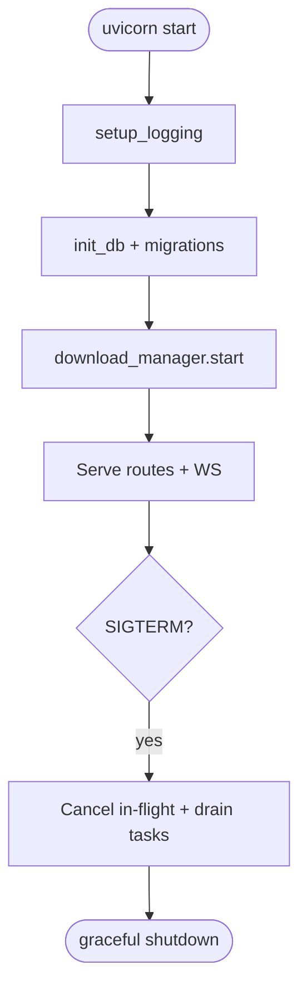

---

## Data Flow

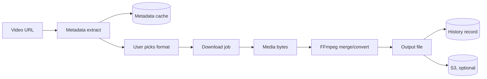

---

## Class Diagram

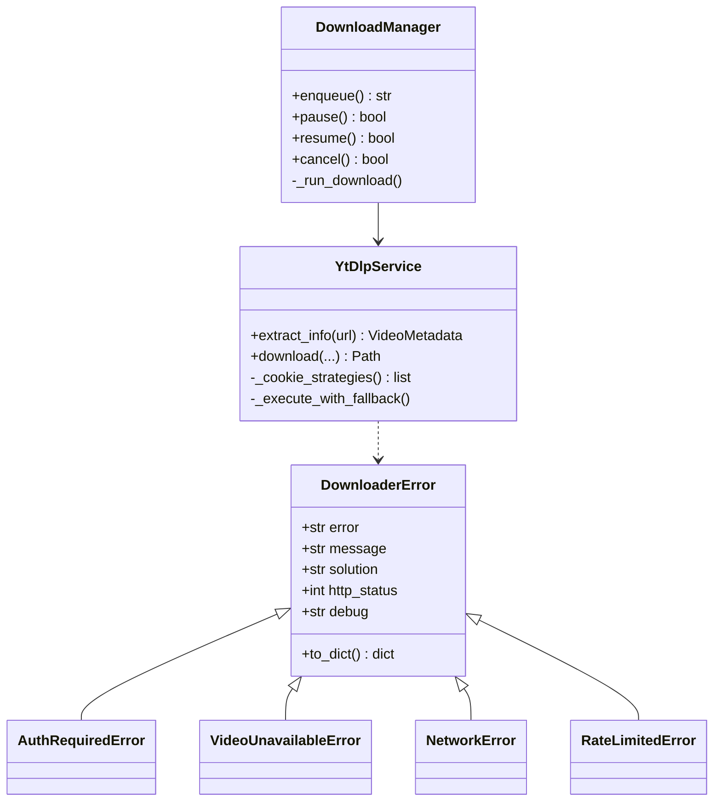

---

## Docker Architecture

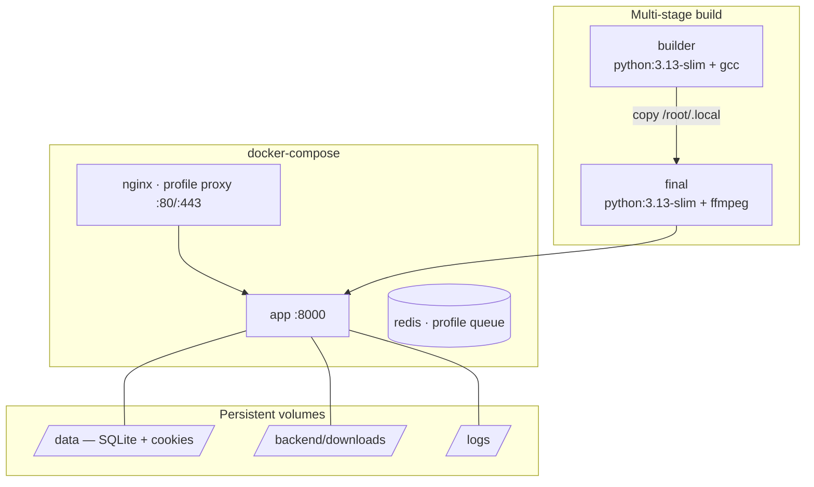

---

## AWS Deployment

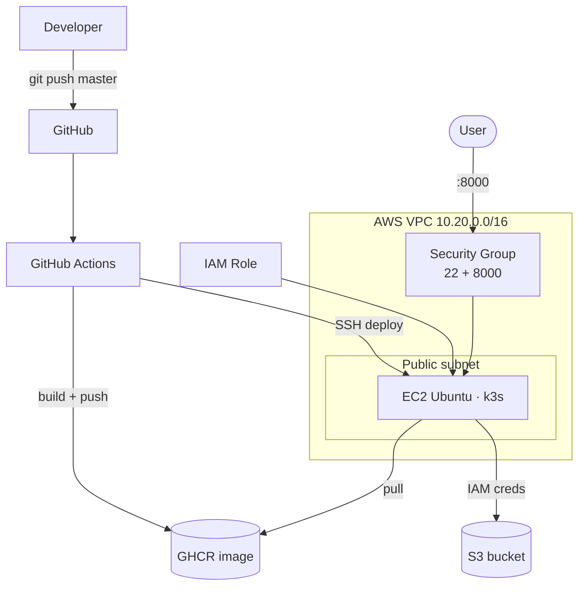

---

## Network Flow

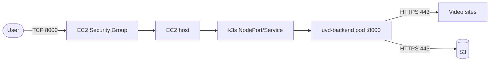

---

## Folder Structure

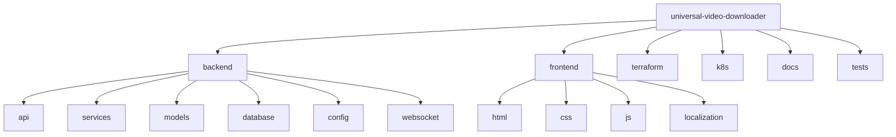

See the full annotated tree in the [README](../README.md#-project-structure).
