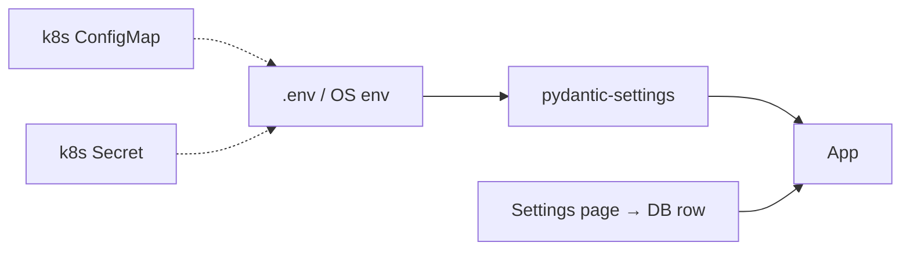

# ⚙️ Configuration Reference

Every configuration surface: environment variables, the Settings page, Docker, and Kubernetes.

## 📑 Contents

- [How configuration is loaded](#how-configuration-is-loaded)
- [Environment variables](#environment-variables)
  - [Application](#application)
  - [Database & storage](#database--storage)
  - [Downloads & media](#downloads--media)
  - [Download pipeline](#download-pipeline--reliability)
  - [Logging & optional services](#logging--optional-services)
  - [AWS S3](#aws-s3)
- [Runtime settings (Settings page)](#runtime-settings-settings-page)
- [Docker configuration](#docker-configuration)
- [Kubernetes configuration](#kubernetes-configuration)
- [Precedence](#precedence)

---

## How configuration is loaded



- **Static config** → environment variables (parsed by `backend/config/settings.py`).
- **User preferences** → the `/settings` page, persisted to the `app_settings` table.
- Copy `.env.example` → `.env` and edit.

---

## Environment variables

### Application

| Variable | Default | Description |
|----------|---------|-------------|
| `DEBUG` | `false` | Verbose errors + autoreload |
| `SECRET_KEY` | `change-me-in-production` | App secret — **change in production** |
| `BACKEND_PORT` | `8000` | HTTP port |
| `FRONTEND_PORT` | `3000` | Reference only (frontend served by backend) |
| `CORS_ORIGINS` | `["http://localhost:3000","http://localhost:8000"]` | Allowed origins (JSON array) |
| `RATE_LIMIT` | `30/minute` | Global API rate limit |

### Database & storage

| Variable | Default | Description |
|----------|---------|-------------|
| `DATABASE_URL` | `sqlite+aiosqlite:///./data/app.db` | Async DB connection string |
| `DOWNLOADS_DIR` | `./backend/downloads` | Output directory |
| `TEMP_DIR` | `./backend/downloads/temp` | In-progress files |

### Downloads & media

| Variable | Default | Description |
|----------|---------|-------------|
| `MAX_CONCURRENT_DOWNLOADS` | `3` | Parallel downloads (semaphore) |
| `FFMPEG_LOCATION` | _(PATH)_ | Custom FFmpeg binary path |
| `COOKIES_FILE` | `./data/cookies.txt` | Netscape cookies path |
| `METADATA_CACHE_TTL` | `3600` | Metadata cache lifetime (seconds) |

### Download pipeline & reliability

| Variable | Default | Description |
|----------|---------|-------------|
| `COOKIES_FROM_BROWSER` | `true` | Try browser cookies before `cookies.txt`. **Set `false` on headless servers.** |
| `COOKIE_BROWSER_ORDER` | `["chrome","chromium","edge","firefox"]` | Browser attempt order |
| `YTDLP_SOCKET_TIMEOUT` | `30` | Per-connection socket timeout (s) |
| `YTDLP_RETRIES` | `3` | yt-dlp HTTP/fragment retries |
| `EXTRACT_TIMEOUT` | `90` | Wall-clock timeout for metadata extraction (s) |
| `TRANSIENT_RETRY_ATTEMPTS` | `2` | Extra retries for transient network/rate errors |

### Logging & optional services

| Variable | Default | Description |
|----------|---------|-------------|
| `LOG_LEVEL` | `INFO` | `DEBUG`/`INFO`/`WARNING`/`ERROR` |
| `LOG_DIR` | `./logs` | Log output directory |
| `REDIS_URL` | _(none)_ | Optional Redis (future queue backend) |

### AWS S3

| Variable | Default | Description |
|----------|---------|-------------|
| `S3_ENABLED` | `false` | Upload finished files to S3 |
| `AWS_REGION` | `us-east-1` | Bucket region |
| `AWS_S3_BUCKET` | _(empty)_ | Bucket name |
| `AWS_ACCESS_KEY_ID` | _(empty)_ | Access key (omit with IAM role) |
| `AWS_SECRET_ACCESS_KEY` | _(empty)_ | Secret key (omit with IAM role) |
| `S3_PREFIX` | `downloads` | Object key prefix |
| `S3_DELETE_LOCAL_AFTER_UPLOAD` | `true` | Remove local file after upload |

---

## Runtime settings (Settings page)

Stored per-install in the `app_settings` table and editable at `/settings`:

| Setting | Default | Description |
|---------|---------|-------------|
| `default_quality` | `best` | Pre-selected quality |
| `default_format` | `mp4` | Pre-selected format |
| `default_folder` | `""` | Preferred output folder |
| `preferred_language` | `en` | UI language (`en`/`ru`/`hy`) |
| `theme` | `dark` | `dark` / `light` |
| `max_concurrent_downloads` | `3` | Parallelism |
| `auto_convert_mp3` | `false` | Auto-extract MP3 |
| `auto_update_ytdlp` | `false` | Auto-update yt-dlp |
| `ffmpeg_location` | `""` | Custom FFmpeg path |
| `cookies_file` | `""` | Overrides `COOKIES_FILE` when set |

---

## Docker configuration

`docker-compose.yml` reads variables from `.env` via `env_file`. Override at runtime:

```bash
BACKEND_PORT=9000 MAX_CONCURRENT_DOWNLOADS=5 docker compose up -d
```

Volumes and profiles are documented in **[DOCKER.md](DOCKER.md)**.

---

## Kubernetes configuration

- **Non-secret values** → `k8s/configmap.yaml` (`uvd-config`).
- **Secrets** (`SECRET_KEY`, AWS keys) → the `uvd-secrets` Secret, created by the deploy workflow.
- On the headless cluster, `COOKIES_FROM_BROWSER` is set to `false`.

```yaml
# k8s/configmap.yaml (excerpt)
data:
  BACKEND_PORT: "8000"
  COOKIES_FILE: "./data/cookies.txt"
  COOKIES_FROM_BROWSER: "false"
  MAX_CONCURRENT_DOWNLOADS: "3"
```

---

## Precedence

From highest to lowest:

1. **Settings page** value (when non-empty) — e.g. `cookies_file`, `ffmpeg_location`
2. **Environment variable** / `.env`
3. **Built-in default**

For cookies specifically: settings override → env path → `./data/cookies.txt` → legacy `./config/cookies.txt`.
