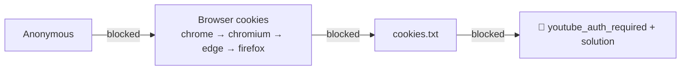

# 🍪 Cookies & YouTube Authentication

The complete guide to fixing **“Sign in to confirm you’re not a bot”** and other auth walls.

## 📑 Contents

- [Why YouTube blocks downloads](#why-youtube-blocks-downloads)
- [How the app handles it (fallback chain)](#how-the-app-handles-it-fallback-chain)
- [Get cookies.txt — step by step](#get-cookiestxt--step-by-step)
  - [Chrome](#chrome) · [Edge](#edge) · [Firefox](#firefox) · [Brave](#brave) · [Chromium](#chromium)
- [Upload cookies to the app](#upload-cookies-to-the-app)
- [Where cookies are stored](#where-cookies-are-stored)
- [Troubleshooting](#troubleshooting)
- [FAQ](#faq)
- [Security](#security)

---

## Why YouTube blocks downloads

YouTube uses bot-detection that increasingly requires a **logged-in session** to access video streams from datacenter IPs (like a VPS or EC2 box). Without a valid session it returns:

> `ERROR: [youtube] …: Sign in to confirm you're not a bot.`

Providing your browser's **cookies** lets yt-dlp act as your logged-in session, which clears the check. This is normal, supported yt-dlp behavior.

---

## How the app handles it (fallback chain)



- On your **desktop**, `COOKIES_FROM_BROWSER=true` lets the app read cookies straight from an installed browser — often **zero manual steps**.
- On a **server** (Docker/EC2/k3s) there is no browser, so set `COOKIES_FROM_BROWSER=false` and upload a `cookies.txt` instead.

---

## Get cookies.txt — step by step

Use the **“Get cookies.txt LOCALLY”** extension (open-source, exports in Netscape format). It works across Chromium browsers and Firefox.

> [!TIP]
> Always export **while logged in** to YouTube, and use a normal (not Incognito) window.

### Chrome

1. Install **“Get cookies.txt LOCALLY”** from the Chrome Web Store.
2. Log in to <https://www.youtube.com>.
3. Click the extension icon → **Export** (or *Export As* → `cookies.txt`).
4. Save the `cookies.txt` file.

### Edge

1. Install the same extension from the **Edge Add-ons** store (or the Chrome Web Store — Edge supports it).
2. Log in to YouTube → click the extension → **Export**.

### Firefox

1. Install **“Get cookies.txt LOCALLY”** from **Firefox Add-ons**.
2. Log in to YouTube → click the extension → **Export**.

### Brave

1. Brave uses the Chrome Web Store — install the extension there.
2. Disable Brave Shields for youtube.com if the extension can't read cookies, then **Export**.

### Chromium

1. Install via the Chrome Web Store (Chromium supports Chrome extensions).
2. Log in → **Export**.

---

## Upload cookies to the app

**Option A — Settings page (recommended, works everywhere):**

1. Open **`http://SERVER_IP:8000/settings`**.
2. Go to the **Cookies** section.
3. **Upload** the `cookies.txt` file *or* **paste** its contents.
4. Click **Save**. ✅

**Option B — place the file manually (local dev):**

```text
universal-video-downloader/
└── data/
    └── cookies.txt   ← put it here (default COOKIES_FILE)
```

Then restart the app. The legacy path `./config/cookies.txt` is also checked.

**Option C — API:**

```bash
curl -X POST http://SERVER_IP:8000/api/settings/cookies -F "file=@cookies.txt"
```

---

## Where cookies are stored

| Location | Notes |
|----------|-------|
| `./data/cookies.txt` | Default. Mounted as a persistent volume in Docker/k8s |
| `./config/cookies.txt` | Legacy fallback (still read if present) |

Uploading via the UI also **clears the metadata cache** so previous bot-block errors don't stick.

---

## Troubleshooting

| Symptom | Fix |
|---------|-----|
| Still blocked after upload | Re-export **fresh** cookies while logged in; they expire |
| "Invalid cookies.txt format" | Export in **Netscape** format (the extension does this) |
| Works then breaks in a day | YouTube rotated the session — re-export |
| Server never uses browser | Correct — set `COOKIES_FROM_BROWSER=false` and upload a file |
| `--cookies-from-browser` fails locally | Close the browser or make sure the app runs as the same OS user |

---

## FAQ

<details>
<summary><b>Do I need cookies for every site?</b></summary>

No — most sites work anonymously. Cookies are mainly for YouTube and login-only content.
</details>

<details>
<summary><b>How often do I re-export?</b></summary>

When you start seeing auth errors again. Sessions can last days to weeks.
</details>

<details>
<summary><b>Can I use cookies from a different browser than the extension?</b></summary>

Yes — any Netscape `cookies.txt` for the target site works.
</details>

---

## Security

> [!CAUTION]
> `cookies.txt` contains a live login session for your account. Anyone with it can access your logged-in YouTube. Treat it like a password.

- It is **gitignored** and never committed.
- It is never logged or included in error responses.
- Store the app behind HTTPS and restrict who can reach `/settings`.
- Prefer a dedicated/throwaway account if you're uncomfortable using your main one.

See also: **[SECURITY.md](../SECURITY.md)**.
