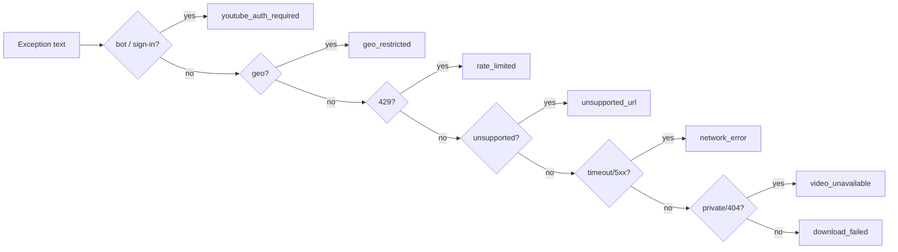

# 🚦 Error Reference

Every failure in the backend is translated into a **structured JSON envelope**. Raw yt-dlp exceptions and stack traces are **never** returned to clients — the original text is kept only in server logs (`debug`).

```json
{
  "success": false,
  "error": "youtube_auth_required",
  "message": "Authentication required.",
  "solution": "Upload cookies.txt in Settings, then try again."
}
```

Defined in [`backend/services/exceptions.py`](../backend/services/exceptions.py).

## 📋 Error codes

| Code | HTTP | Meaning | Typical cause | Fix |
|------|:----:|---------|---------------|-----|
| `youtube_auth_required` | 401 | YouTube needs sign-in | "Sign in to confirm you're not a bot" | Upload `cookies.txt` ([COOKIES.md](COOKIES.md)) |
| `auth_required` | 401 | Non-YouTube site needs auth | Login-only content | Provide cookies for that site |
| `video_unavailable` | 404 | Video can't be accessed | Private, deleted, or 404 (also outdated Rutube extractor) | Verify URL; update yt-dlp |
| `geo_restricted` | 451 | Blocked in server region | Country restriction | Use region-appropriate cookies |
| `rate_limited` | 429 | Too many requests | 429 from the site | Wait; cookies often help |
| `unsupported_url` | 400 | Not a supported site | Wrong/typo URL, no extractor | Use a supported site URL |
| `invalid_url` | 400 | Malformed URL | Not `http(s)://…` | Paste a valid URL |
| `network_error` | 502 | Network/timeout | DNS, timeout, 5xx | Check connectivity; retry |
| `cancelled` | 409 | User cancelled | Cancel pressed / shutdown | Start again if unintended |
| `download_failed` | 422 | Generic failure | Anything else | Verify URL; update yt-dlp |
| `internal_error` | 500 | Unexpected server bug | Programming error | Check logs; open an issue |

---

## How classification works

The classifier (`classify_ytdlp_error`) inspects the exception message and maps it by pattern:



Only **auth** and **rate-limit** errors advance the cookie fallback chain; everything else fails fast because cookies can't fix it. See the [Cookie Authentication Flow](ARCHITECTURE.md#cookie-authentication-flow).

---

## Handling errors in a client

```javascript
try {
  const res = await fetch("/api/info", { method: "POST", body: JSON.stringify({ url }) });
  if (!res.ok) {
    const { error, message, solution } = await res.json();
    showError(`${message}\n${solution}`);   // e.g. show a "Upload cookies" hint
  }
} catch (e) { /* network */ }
```

Over WebSocket, failed downloads include the same `error` / `solution` fields on the progress payload.

---

## Related

- [COOKIES.md](COOKIES.md) — resolve `youtube_auth_required`
- [TROUBLESHOOTING.md](TROUBLESHOOTING.md) — diagnostic steps
- [API.md](API.md) — endpoint-level error notes
